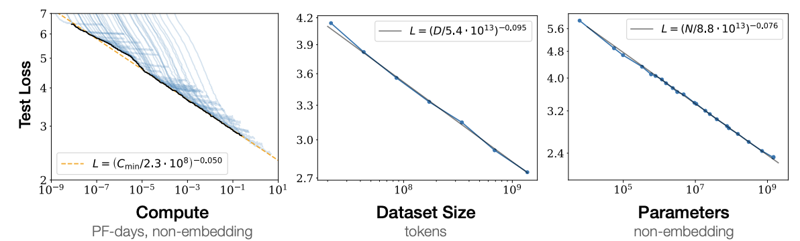

<!-- _class: title -->
# QLoRAを用いた日本語LLMの軽量ファインチューニング  
青井研 M2 向井拓海  
2025年4月  

---

# AIの歴史

| ブーム | 時期 | キーワード | 特徴 | 例 |
| --- | --- | --- | --- | --- |
| 第一次AIブーム | 1956~1960年 | 探索・推論 | ルールに従って考えるAI | 迷路探索 |
| 第二次AIブーム | 1980年 | エキスパートシステム | 人の知識をルールにして活用 | 医療診断 |
| 第三次AIブーム | 2013年~ | 機械学習・深層学習 | データから自分で学ぶAI | 画像・言語処理 |

---

# ChatGPTについて

- 2022年11月にOpenAIが公開した対話型AI  
- ChatGPT = Chat + GPT（Generative Pre-trained Transformer）  
- 「次に来る単語」を予測して会話を生成する仕組み  

例：「今日は〇〇です」→「晴れ」「雨」「水曜日」などを確率で予測

---

# LLMのスケールについて

- LLMの性能は「スケール則」に従う  
  - データ量  
  - モデルサイズ（パラメータ数）  
  - 計算資源（GPUなど）  
- 通常のMLと違い、モデルが大きくなっても過学習しにくい  

---

# ファインチューニングとは？

- 既に学習済みのLLMをベースに、一部だけ学習し直すこと  
- 少ないデータで特定タスクに適応させられる  
- 計算コスト・時間を大幅に削減可能  

  

---

# 量子化とは？

> $$
> E = mc^2
> $$
> 

---

# QLoRAとは？

- **LoRA（Low-Rank Adaptation）**  
  - LLMの一部だけ学習する技術（adapter挿入）  
- **QLoRA（Quantized LoRA）**  
  - モデルを量子化し、さらにLoRAで学習  

🔧 小型パーツ（adapter）だけ学習させてモデルを賢くする！

---

# 研究の目的と実験内容

- 目的：  
  「BKCはどこにありますか？」という質問に正しく答えるLLMを作る  

- 実験内容：  
  - Gemma-2-2B-jpn-it をQLoRAでファインチューニング  
  - 学習データは数十件程度（プロンプト+回答）  

🎓 ローカル知識に特化したLLMを育てる！

---

# 使用するライブラリと実装環境

- 主なライブラリ：
  - `transformers`（HuggingFace）
  - `peft`（Parameter-Efficient Fine-Tuning）
  - `bitsandbytes`（量子化）
- 実行環境：
  - Google Colab / 自宅GPU (例: RTX 4090)  

💻 Pythonコードでシンプルに実行可能！

---

# ファインチューニングの流れ

1. `Gemma-2-2b-jpn-it` を読み込み  
2. 学習データ作成（プロンプト+応答）  
3. PEFTでLoRA adapterを挿入  
4. QLoRAで数epoch学習  
5. 応答の変化を確認  

📊 全体の流れを1枚の図で整理

---

# 結果（学習前 vs 学習後）

- 学習前：  
  「BKCはどこ？」→「情報が見つかりません」  
- 学習後：  
  「BKCは立命館大学びわこ・くさつキャンパスの略称です」  

✨ 数十件の学習でピンポイント知識を習得！

---

# 今後の展望と応用可能性

- 複数質問への対応  
- 他モデルとの比較（Mistral, Llamaなど）  
- 医療・教育・FAQボットなどへの応用  
- 個人専用ChatGPTの実現も可能に？

🤖 「自分だけのLLM」、何に使いたい？

---

# 参考文献・関連技術

- [スケール則](https://arxiv.org/pdf/2001.08361) 
